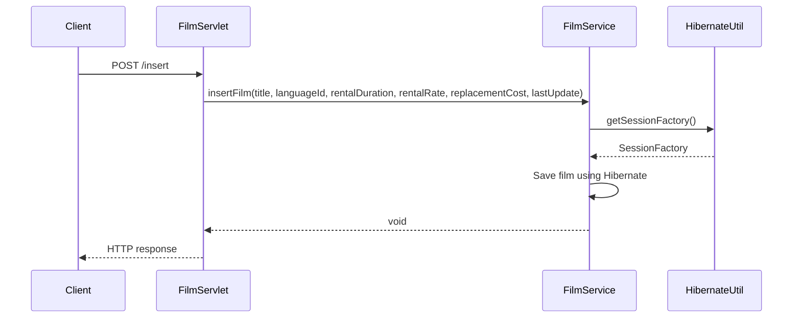
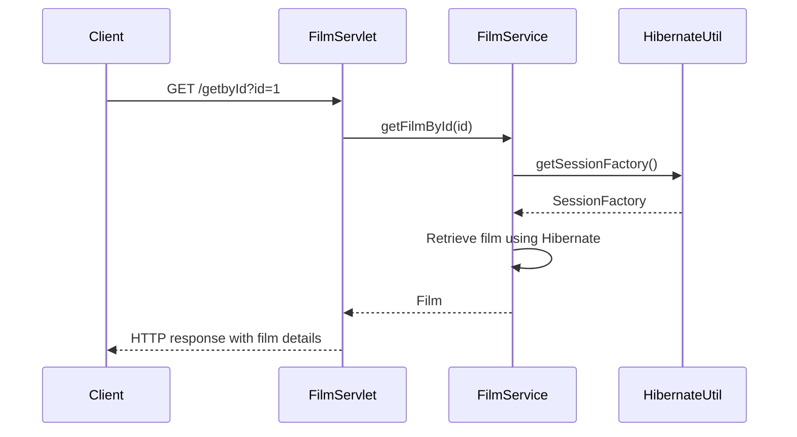

# Film Management System

## Overview
The Film Management System is a web-based application that allows users to manage films, actors, and perform various operations related to the film industry. It provides functionality to insert, update, delete, and retrieve films and actors, as well as search for films based on different criteria.

## Business Rules
- Each film has a title, language, rental duration, rental rate, replacement cost, and last update date.
- Films can be associated with multiple actors and categories.
- Actors have a first name and last name.
- Films can be searched based on title, rating, and category.
- Actors can be retrieved based on the number of films they have acted in.
- Actors can be retrieved based on the genres of films they have acted in.
- The system uses a stored procedure to retrieve actors based on film name and genre.

## Description
The Film Management System consists of several components:

1. **ActorService**: This service class provides methods to perform CRUD operations on actors. It includes methods to insert, update, delete, and retrieve actors based on different criteria.

2. **FilmService**: This service class provides methods to perform CRUD operations on films. It includes methods to insert, update, delete, and retrieve films based on different criteria. It also provides methods to retrieve actors associated with a film.

3. **FilmServlet**: This servlet class handles the HTTP requests related to films and actors. It maps the incoming requests to the appropriate methods in the service classes and returns the response in JSON format.

4. **HibernateUtil**: This utility class is responsible for creating and managing the Hibernate session factory. It configures the database connection properties and maps the entity classes to the database tables.

## Dependencies
The Film Management System has the following dependencies:

- Java Servlet API: Used for handling HTTP requests and responses.
- Hibernate ORM: Used for object-relational mapping and database operations.
- MySQL Connector/J: Used for connecting to the MySQL database.
- JSON.org: Used for JSON parsing and generation.

## Sequence Diagrams

### Insert Film

### Get Film by ID

## Tech Stack
The Film Management System uses the following technologies:

- Java: The primary programming language used for developing the application.
- Hibernate: An object-relational mapping (ORM) tool used for database operations.
- MySQL: The relational database management system used for storing film and actor data.
- Servlet API: Used for handling HTTP requests and responses.
- JSON: Used for data exchange between the client and the server.
- HTML/CSS: Used for creating the user interface of the web application.

The combination of these technologies provides a robust and efficient solution for managing films and actors in the Film Management System.