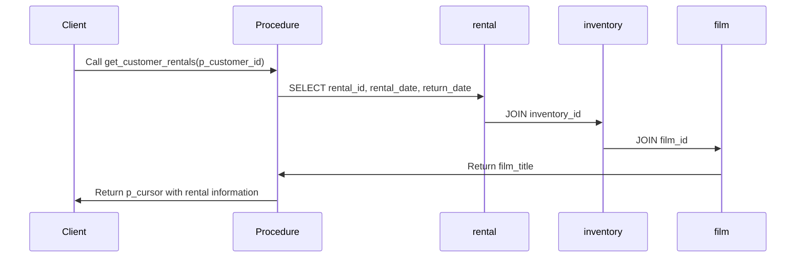
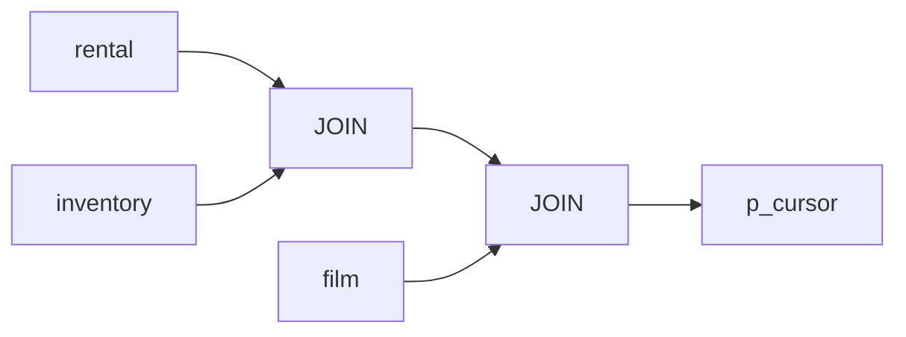

# Procedure: DEMO.get_customer_rentals

## Description
This procedure retrieves rental information for a specific customer, including the rental ID, rental date, return date, inventory ID, and film title.

## Business Rules
- The procedure takes a customer ID as input and returns a cursor containing the rental information for that customer.

## Data Interaction Details
- The procedure joins the `rental`, `inventory`, and `film` tables to retrieve the necessary information.
- It filters the results based on the provided customer ID.

## Parameters
- `p_customer_id` (IN): The ID of the customer for which to retrieve rental information.
- `p_cursor` (OUT): A cursor that will hold the result set containing the rental information.

## Code Metrics
- Lines of code: 11
- Number of cursors: 1 (p_cursor)
- Number of exception blocks: 0

## Logic Structure
1. Open the cursor `p_cursor`.
2. Execute a SELECT statement to retrieve rental information for the specified customer.
   - Join the `rental`, `inventory`, and `film` tables.
   - Filter the results based on the provided `p_customer_id`.
3. Return the cursor containing the rental information.

## Nested Elements
- The procedure does not contain any nested elements.

## Dependencies
- The procedure depends on the following tables:
  - `rental`
  - `inventory`
  - `film`

## Overview
The `DEMO.get_customer_rentals` procedure is a simple stored procedure that retrieves rental information for a specific customer. It takes a customer ID as input and returns a cursor containing the rental ID, rental date, return date, inventory ID, and film title for all rentals associated with that customer.

## Sequence Diagram

## Lineage Graph

## Complexity of the Procedure
The complexity of the `DEMO.get_customer_rentals` procedure is relatively low. It performs a straightforward join operation on three tables and filters the results based on a single condition. The procedure does not contain any complex logic or nested elements, making it easy to understand and maintain.