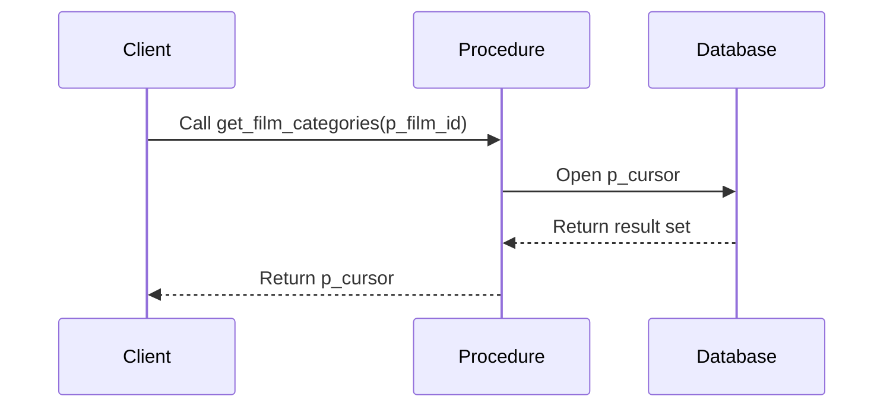
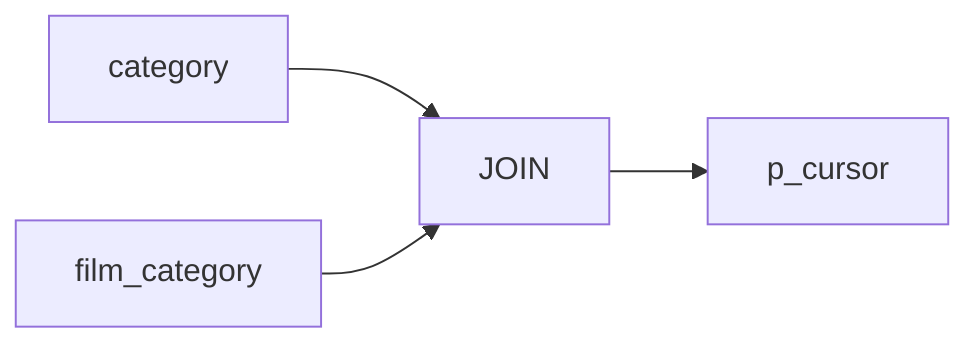

# Procedure Summary: DEMO.get_film_categories

## Description
This procedure retrieves the category information for a given film ID.

## Business Rules
- The procedure takes a film ID as input and returns the corresponding category details.
- It uses a cursor to return the result set.

## Data Interaction Details
- The procedure joins the `category` and `film_category` tables to retrieve the category information for the specified film ID.
- It opens a cursor (`p_cursor`) to return the result set containing the category ID and category name.

## Parameters
- `p_film_id` (IN): The ID of the film for which to retrieve the category information.
- `p_cursor` (OUT): A cursor that holds the result set containing the category details.

## Code Metrics
- Lines of code: 10
- Number of cursors: 1 (`p_cursor`)
- Number of exception blocks: 0

## Logic Structure
1. The procedure starts with the `BEGIN` keyword.
2. It opens the `p_cursor` cursor using the `OPEN` statement.
3. The cursor query selects the `category_id` and `name` columns from the `category` table.
4. It joins the `category` table with the `film_category` table based on the `category_id` column.
5. The query filters the results based on the provided `p_film_id` parameter.
6. The procedure ends with the `END` keyword.

## Nested Elements
- The procedure does not contain any nested elements.

## Dependencies
- The procedure depends on the `category` and `film_category` tables.

## Overview
The `DEMO.get_film_categories` procedure is a simple procedure that retrieves the category information for a given film ID. It takes a film ID as input and returns a cursor containing the category ID and category name associated with that film. The procedure performs a join between the `category` and `film_category` tables to fetch the relevant category details.

## Sequence Diagram

## Lineage Graph

## Complexity of the Procedure
The complexity of the `DEMO.get_film_categories` procedure is relatively low. It performs a simple join between two tables and returns the result set through a cursor. The procedure does not contain any complex logic or nested elements, making it straightforward to understand and maintain.