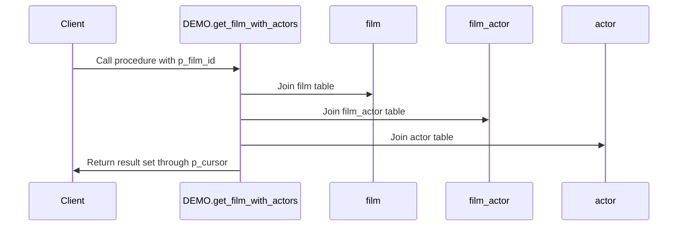
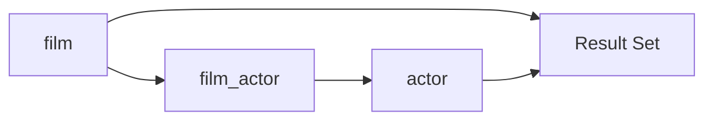

# Procedure Summary: DEMO.get_film_with_actors

## Description
This procedure retrieves information about a specific film and its associated actors based on the provided film ID.

## Business Rules
- The procedure takes a film ID as input and returns a result set containing the film's details and the actors who appeared in that film.

## Data Interaction Details
- The procedure joins the `film`, `film_actor`, and `actor` tables to retrieve the required information.
- It uses the input parameter `p_film_id` to filter the results based on the specified film ID.

## Parameters
- `p_film_id` (IN): The ID of the film for which the details and actors need to be retrieved.
- `p_cursor` (OUT): A reference cursor that will hold the result set containing the film and actor information.

## Code Metrics
- Lines of code: 14
- Number of cursors: 1 (p_cursor)
- Number of exception blocks: 0

## Logic Structure
1. The procedure starts with the `BEGIN` keyword.
2. It opens the `p_cursor` for a SELECT statement.
3. The SELECT statement joins the `film`, `film_actor`, and `actor` tables based on the film ID and actor ID relationships.
4. The WHERE clause filters the results based on the provided `p_film_id`.
5. The procedure ends with the `END` keyword.

## Nested Elements
- There are no nested elements in this procedure.

## Dependencies
- The procedure depends on the `film`, `film_actor`, and `actor` tables.

## Overview
The `DEMO.get_film_with_actors` procedure is a simple stored procedure that retrieves information about a specific film and its associated actors. It takes a film ID as input and returns a result set containing the film's details (film ID, title, description) and the actors who appeared in that film (actor ID, first name, last name). The procedure joins the necessary tables and filters the results based on the provided film ID.

## Sequence Diagram

## Lineage Graph

## Complexity of the Procedure
The complexity of the `DEMO.get_film_with_actors` procedure is relatively low. It performs a straightforward join operation on three tables and filters the results based on a single input parameter. The procedure does not contain any complex logic or nested elements, making it easy to understand and maintain.