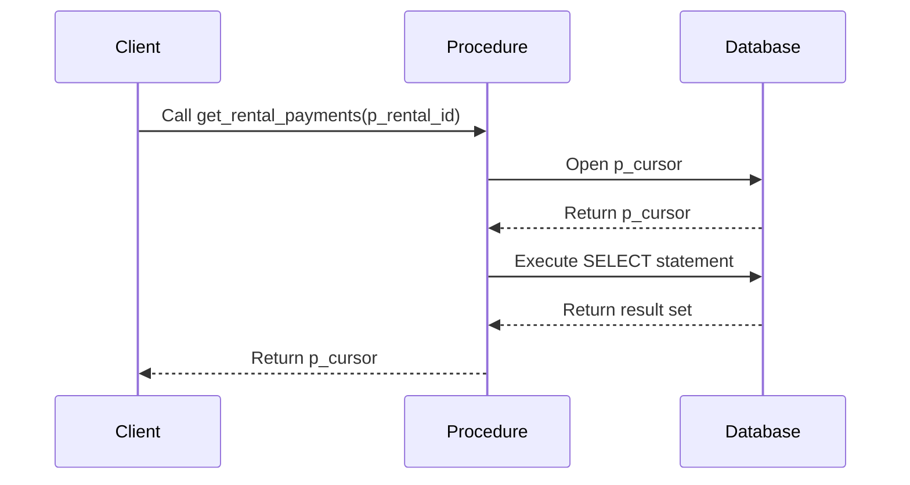
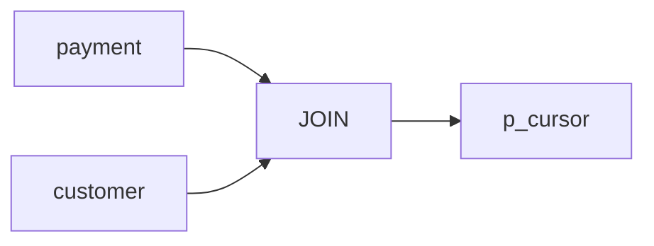

# Procedure Summary: DEMO.get_rental_payments

## Description
This procedure retrieves rental payment information along with customer details for a given rental ID.

## Business Rules
- The procedure takes a rental ID as input and returns the corresponding payment details.
- It joins the `payment` and `customer` tables to retrieve the customer's first and last name associated with each payment.

## Data Interaction Details
- The procedure uses a cursor `p_cursor` to return the result set.
- It performs an inner join between the `payment` and `customer` tables based on the `customer_id` column.
- The `WHERE` clause filters the payments based on the provided `p_rental_id` parameter.

## Parameters
- `p_rental_id` (IN): The rental ID for which payment details are requested.
- `p_cursor` (OUT): A cursor that holds the result set containing payment and customer information.

## Code Metrics
- Lines of code: 10
- Number of cursors: 1 (`p_cursor`)
- Number of exception blocks: 0

## Logic Structure
1. Open the `p_cursor` cursor.
2. Execute the SELECT statement to retrieve payment and customer details for the given `p_rental_id`.
3. Return the result set through the `p_cursor` cursor.

## Nested Elements
- The procedure does not contain any nested elements.

## Dependencies
- The procedure depends on the `payment` and `customer` tables.

## Overview
The `DEMO.get_rental_payments` procedure is a simple stored procedure that retrieves rental payment information along with customer details for a specific rental ID. It takes the rental ID as input and returns a result set containing the payment ID, amount, payment date, and customer's first and last name. The procedure uses a cursor to hold the result set and performs an inner join between the `payment` and `customer` tables to fetch the required data.

## Sequence Diagram

## Lineage Graph

## Complexity of the Procedure
The complexity of the `DEMO.get_rental_payments` procedure is relatively low. It performs a simple join between two tables and returns the result set through a cursor. The procedure does not contain any complex logic or nested elements, making it straightforward to understand and maintain.