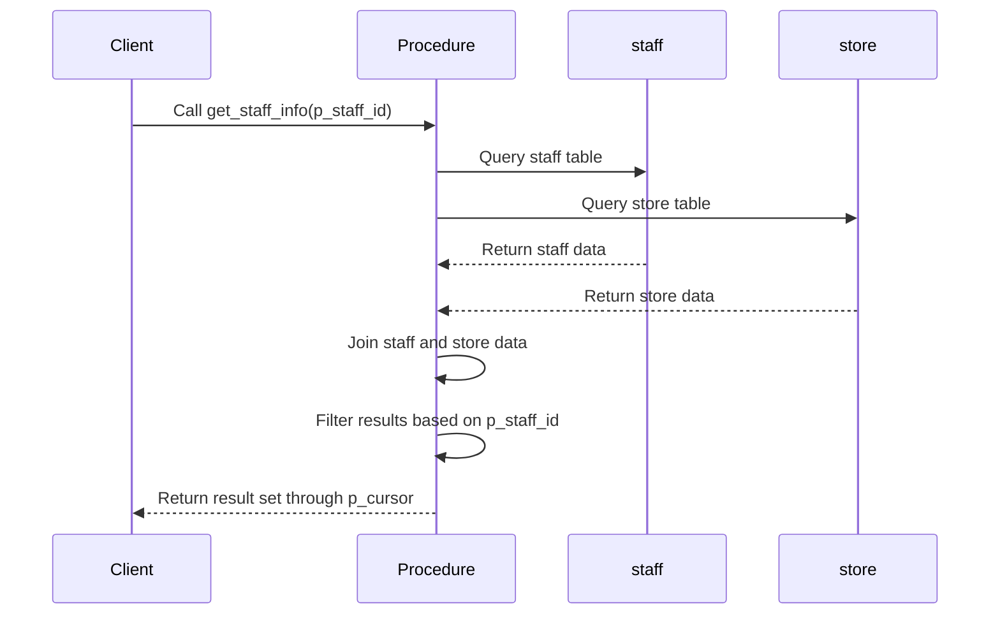
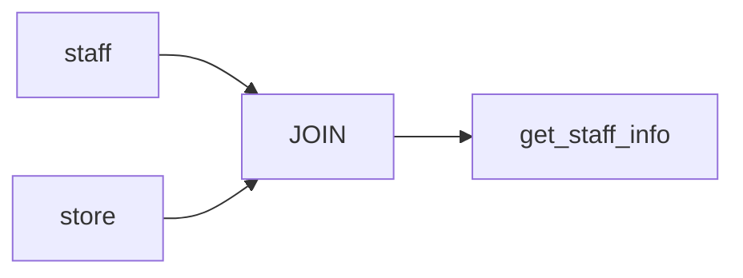

# Procedure: DEMO.get_staff_info

## Description
This procedure retrieves staff information along with the associated store details for a given staff ID.

## Business Rules
- The procedure takes a staff ID as input and returns the corresponding staff information and store details.
- It retrieves the first name, last name, email, store ID, and address ID of the staff member.
- The procedure uses a cursor to return the result set.

## Data Interaction Details
- The procedure queries the `staff` and `store` tables to retrieve the required information.
- It joins the `staff` table with the `store` table based on the `staff_id` and `manager_staff_id` columns.
- The procedure filters the results based on the provided `p_staff_id` parameter.

## Parameters
- `p_staff_id` (IN): The ID of the staff member for which the information is requested.
- `p_cursor` (OUT): A reference cursor that holds the result set containing the staff information and store details.

## Code Metrics
- Lines of code: 11
- Number of cursors: 1 (p_cursor)
- Number of exception blocks: 0

## Logic Structure
1. The procedure starts with the `BEGIN` keyword.
2. It opens the `p_cursor` for a SELECT statement.
3. The SELECT statement retrieves the first name, last name, email, store ID, and address ID from the `staff` and `store` tables.
4. The `staff` table is joined with the `store` table based on the `staff_id` and `manager_staff_id` columns.
5. The results are filtered based on the provided `p_staff_id` parameter.
6. The procedure ends with the `END` keyword.

## Nested Elements
- The procedure does not contain any nested elements.

## Dependencies
- The procedure depends on the `staff` and `store` tables.

## Overview
The `DEMO.get_staff_info` procedure is a simple stored procedure that retrieves staff information along with the associated store details for a given staff ID. It takes a staff ID as input and returns the first name, last name, email, store ID, and address ID of the staff member using a cursor. The procedure joins the `staff` and `store` tables based on the `staff_id` and `manager_staff_id` columns and filters the results based on the provided staff ID.

## Sequence Diagram

## Lineage Graph

## Complexity of the Procedure
The complexity of the `DEMO.get_staff_info` procedure is relatively low. It performs a simple join between two tables and filters the results based on a single parameter. The procedure does not contain any complex logic or nested elements, making it easy to understand and maintain.