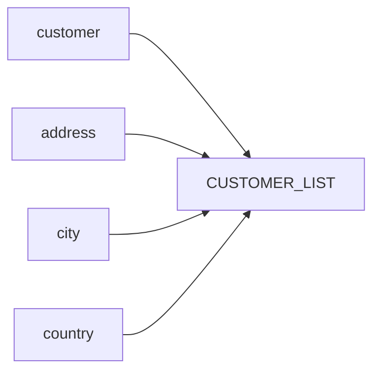

# Customer List View Summary

## Description
The `CUSTOMER_LIST` view provides a consolidated view of customer information by joining data from the `customer`, `address`, `city`, and `country` tables. It retrieves customer details such as ID, name, address, zip code, phone number, city, country, and active status.

## Business Rules
- The view combines data from multiple tables to present a comprehensive view of customer information.
- The `notes` column is derived based on the `active` status of the customer. If the customer is active (value 1), the `notes` column will display 'active'; otherwise, it will be an empty string.

## Data Interaction Details
The view performs the following data interactions:
- Joins the `customer` table with the `address` table based on the `address_id` foreign key.
- Joins the `address` table with the `city` table based on the `city_id` foreign key.
- Joins the `city` table with the `country` table based on the `country_id` foreign key.

## Parameters
The view does not take any parameters.

## Code Metrics
- Lines of code: 12
- Number of joins: 3

## Logic Structure
The view follows a straightforward logic structure:
1. Select the required columns from the `customer` table.
2. Join with the `address` table to retrieve address-related information.
3. Join with the `city` table to retrieve the city name.
4. Join with the `country` table to retrieve the country name.
5. Apply the `decode` function to determine the value of the `notes` column based on the `active` status.

## Nested Elements
The view does not contain any nested elements.

## Dependencies
The view depends on the following tables:
- `customer`
- `address`
- `city`
- `country`

## Overview
The `CUSTOMER_LIST` view provides a consolidated view of customer information by joining data from multiple tables. It retrieves essential customer details such as ID, name, address, zip code, phone number, city, country, and active status. The view simplifies access to customer data by presenting it in a denormalized format.

## Lineage Graph

## Complexity of the View
The complexity of the `CUSTOMER_LIST` view is relatively low. It involves straightforward joins between four tables and applies a simple `decode` function to determine the value of the `notes` column based on the `active` status. The view does not contain any complex calculations or nested elements, making it easy to understand and maintain.