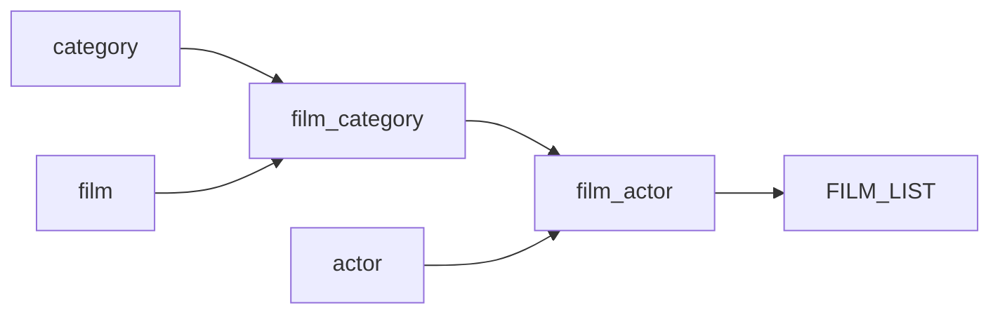

# Summary of the FILM_LIST View

## Description
The FILM_LIST view is a database view that combines information from multiple tables to provide a comprehensive list of films along with their associated details such as title, description, category, price, length, rating, and actors.

## Business Rules
The view follows the following business rules:
- Each film is associated with a category.
- Each film has a rental rate (price), length, and rating.
- Each film can have multiple actors associated with it.

## Data Interaction Details
The view retrieves data from the following tables:
- `category`: Contains information about film categories.
- `film_category`: Establishes the relationship between films and categories.
- `film`: Contains details about individual films.
- `film_actor`: Establishes the relationship between films and actors.
- `actor`: Contains information about actors.

The view performs the following joins:
- Left join between `category` and `film_category` tables based on the `category_id` column.
- Left join between `film_category` and `film` tables based on the `film_id` column.
- Inner join between `film` and `film_actor` tables based on the `film_id` column.
- Inner join between `film_actor` and `actor` tables based on the `actor_id` column.

## Parameters
The view does not take any parameters.

## Code Metrics
- Lines of code: Approximately 12 lines
- Number of joins: 4

## Logic Structure
The view follows a straightforward logic structure:
1. Retrieve film details from the `film` table.
2. Join with the `film_category` table to get the associated category.
3. Join with the `category` table to get the category name.
4. Join with the `film_actor` table to get the associated actors.
5. Join with the `actor` table to get the actor names.
6. Concatenate the first name and last name of actors to form the `actors` column.

## Nested Elements
The view does not contain any nested elements.

## Dependencies
The view depends on the following tables:
- `category`
- `film_category`
- `film`
- `film_actor`
- `actor`

## Overview
The FILM_LIST view provides a consolidated view of film information, including the film's title, description, category, rental rate, length, rating, and associated actors. It combines data from multiple tables to present a comprehensive list of films with their relevant details.

## Lineage Graph

## Complexity of the View
The complexity of the FILM_LIST view is relatively low. It involves straightforward joins between tables and does not contain any complex calculations or aggregations. The view provides a denormalized representation of film information, making it easier to query and retrieve the desired data.