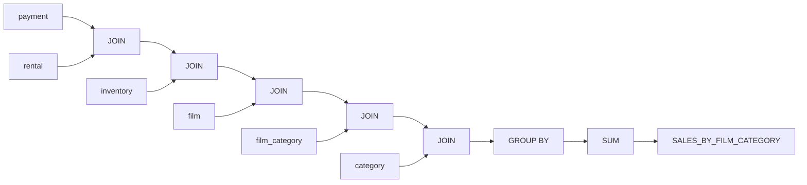

# Sales by Film Category View Summary

## Description
The "SALES_BY_FILM_CATEGORY" view provides a summary of total sales for each film category. It aggregates the sales data from the payment, rental, inventory, film, film_category, and category tables to calculate the total sales amount for each category.

## Business Rules
- The view calculates the total sales for each film category.
- It joins the relevant tables to establish the relationships between payments, rentals, inventory, films, film categories, and categories.
- The total sales amount is summed up for each category.

## Data Interaction Details
The view performs the following data interactions:
1. Joins the payment table with the rental table based on the rental_id column.
2. Joins the rental table with the inventory table based on the inventory_id column.
3. Joins the inventory table with the film table based on the film_id column.
4. Joins the film table with the film_category table based on the film_id column.
5. Joins the film_category table with the category table based on the category_id column.
6. Groups the results by the category name.
7. Sums up the payment amounts for each category to calculate the total sales.

## Parameters
The view does not take any parameters.

## Code Metrics
- Lines of code: 11
- Number of joins: 5
- Number of aggregate functions: 1 (SUM)

## Logic Structure
The view follows a straightforward logic structure:
1. Join the relevant tables to establish the relationships between entities.
2. Group the results by the category name.
3. Sum up the payment amounts for each category to calculate the total sales.

## Nested Elements
The view does not contain any nested elements.

## Dependencies
The view depends on the following tables:
- payment
- rental
- inventory
- film
- film_category
- category

## Overview
The "SALES_BY_FILM_CATEGORY" view provides a summary of total sales for each film category. It aggregates the sales data from multiple tables to calculate the total sales amount for each category. The view helps in analyzing the sales performance of different film categories.

## Lineage Graph

## Complexity of the View
The complexity of the "SALES_BY_FILM_CATEGORY" view is relatively low. It involves joining multiple tables and performing a simple aggregation using the SUM function. The view does not contain any complex calculations or nested elements. The main complexity lies in understanding the relationships between the tables and ensuring the joins are performed correctly to obtain the desired results.