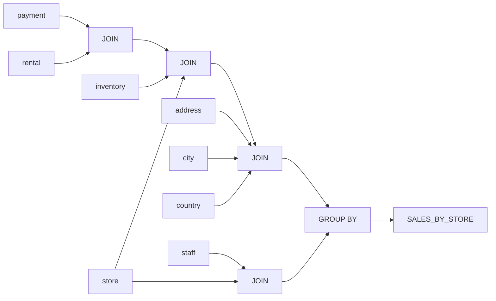

# Summary of the View "SALES_BY_STORE"

## Description
The view "SALES_BY_STORE" provides a summary of total sales for each store, along with the store location and manager information. It combines data from multiple tables to present a consolidated view of sales performance.

## Business Rules
- The view calculates the total sales for each store by summing the payment amounts.
- It includes the store location in the format "city,country" and the full name of the store manager.

## Data Interaction Details
The view retrieves data from the following tables:
- `payment`: Contains payment information.
- `rental`: Contains rental information.
- `inventory`: Contains inventory information.
- `store`: Contains store information.
- `address`: Contains address information.
- `city`: Contains city information.
- `country`: Contains country information.
- `staff`: Contains staff information.

The tables are joined using the following relationships:
- `payment` is joined with `rental` based on the `rental_id` column.
- `rental` is joined with `inventory` based on the `inventory_id` column.
- `inventory` is joined with `store` based on the `store_id` column.
- `store` is joined with `address` based on the `address_id` column.
- `address` is joined with `city` based on the `city_id` column.
- `city` is joined with `country` based on the `country_id` column.
- `store` is joined with `staff` based on the `manager_staff_id` column.

## Parameters
The view does not take any parameters.

## Code Metrics
- Lines of code: 19
- Number of tables joined: 8

## Logic Structure
The view performs the following steps:
1. Joins the necessary tables based on the specified relationships.
2. Groups the data by store ID, store location, and manager name.
3. Calculates the total sales for each store by summing the payment amounts.

## Nested Elements
The view does not contain any nested elements.

## Dependencies
The view depends on the following tables:
- `payment`
- `rental`
- `inventory`
- `store`
- `address`
- `city`
- `country`
- `staff`

## Overview
The "SALES_BY_STORE" view provides a summary of total sales for each store, along with the store location and manager information. It combines data from multiple tables to present a consolidated view of sales performance. The view calculates the total sales by summing the payment amounts and groups the results by store ID, store location, and manager name.

## Lineage Graph

## Complexity of the View
The view has a moderate level of complexity due to the multiple table joins involved. It joins eight tables to combine the necessary data for calculating the total sales by store. The view performs aggregation and grouping operations to summarize the sales data. While the logic is straightforward, the number of tables and the joining conditions contribute to the overall complexity of the view.