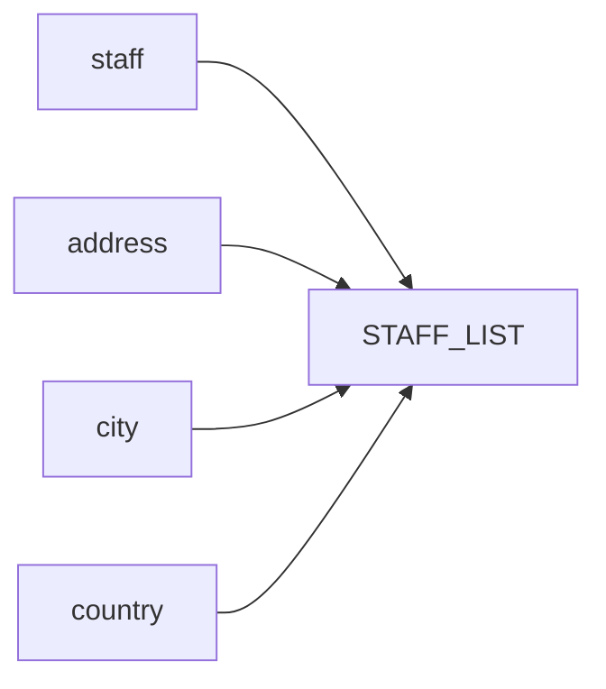

# Summary of the View

## Description
The `STAFF_LIST` view is created in the `DEMO` schema. It combines information from the `staff`, `address`, `city`, and `country` tables to provide a comprehensive list of staff members along with their contact details and location information.

## Business Rules
- The view retrieves data from the `staff`, `address`, `city`, and `country` tables.
- It combines the `first_name` and `last_name` columns from the `staff` table to create a `name` column.
- The `address`, `postal_code`, `phone`, `city`, and `country` columns are retrieved from their respective tables.
- The `store_id` column from the `staff` table is included as `SID`.

## Data Interaction Details
- The view performs inner joins between the `staff`, `address`, `city`, and `country` tables based on the respective foreign key relationships.
- The `address_id` column from the `staff` table is joined with the `address_id` column from the `address` table.
- The `city_id` column from the `address` table is joined with the `city_id` column from the `city` table.
- The `country_id` column from the `city` table is joined with the `country_id` column from the `country` table.

## Parameters
The view does not take any parameters.

## Code Metrics
- Lines of code: 12
- Number of tables joined: 4 (`staff`, `address`, `city`, `country`)
- Number of columns selected: 8 (`ID`, `name`, `address`, `zip_code`, `phone`, `city`, `country`, `SID`)

## Logic Structure
The view performs a straightforward join operation between the `staff`, `address`, `city`, and `country` tables to retrieve the desired columns.

## Nested Elements
There are no nested elements in this view.

## Dependencies
The view depends on the following tables:
- `DEMO.staff`
- `DEMO.address`
- `DEMO.city`
- `DEMO.country`

## Overview
The `STAFF_LIST` view provides a consolidated view of staff information, including their names, addresses, phone numbers, and location details. It simplifies the retrieval of staff data by joining multiple tables and presenting the relevant columns in a single view.

## Lineage Graph

## Complexity of the View
The complexity of the `STAFF_LIST` view is relatively low. It involves a straightforward join operation between four tables based on their foreign key relationships. The view does not contain any complex calculations, aggregations, or subqueries. The lineage graph shows a simple flow of data from the source tables to the final view.