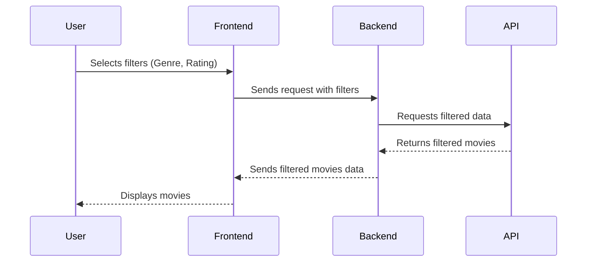

# Project Description

## Overview

The project is a dynamic web application designed to allow users to browse and filter movies based on various criteria. Built using AngularJS, it leverages the framework's capabilities to create a single-page application (SPA) that is both responsive and interactive. The core functionality revolves around presenting a curated list of movies, which users can filter through a simple, intuitive interface.

## Business Rules

1. **Data Fetching and Presentation**:
    - The application must fetch movie data from a predefined API endpoint.
    - Each movie's data should include at least the title, image, actor(s), genre, and release year.
    - The fetched data is to be presented as cards in the UI, with each card representing a movie.

2. **User Interaction**:
    - Users should be able to filter movies by title, genre (category), and rating through a search interface.
    - The search interface will consist of text input for titles and dropdowns for genres and ratings.
    - Movie cards must update dynamically to reflect the filters applied by the user, without the need for page reloads.

3. **Error Handling**:
    - The application must gracefully handle and display errors encountered during data fetching.
    - Users should be notified if no movies match the filter criteria.

4. **Performance**:
    - The application should minimize the number of requests to the server.
    - Filtering operations should be optimized for performance to ensure a smooth user experience.

5. **Accessibility**:
    - The application must be accessible, following standard web accessibility guidelines to ensure it is usable by as many people as possible.

## Description

The project structure comprises four main files that collectively deliver the application's functionality:

1. **angular.min.js**: A minified version of the AngularJS library, providing the necessary framework to build the application.

2. **app.css**: Contains custom CSS styles defining the appearance of the application, including the layout and styling of movie cards and the search interface.

3. **app.js**: The core JavaScript file where the AngularJS module (`myApp`) is defined along with a controller (`CardController`). This controller is responsible for fetching movie data, processing it for display, and handling user interactions for filtering.

4. **index.html**: The main HTML document that lays out the structure of the application. It loads the AngularJS framework, the application's CSS and JavaScript files, and defines the UI components. The document uses AngularJS directives to bind data from the `CardController` to the view, enabling dynamic updates based on user input.

Overall, the project leverages AngularJS's powerful features to create an interactive, user-friendly movie browsing experience. It emphasizes performance, user interaction, and accessibility, adhering to modern web application development best practices.

## Sequence Diagram

This sequence starts with the User selecting filters like genre and rating. The Frontend sends this information to the Backend, which then requests the filtered data from an external API. The API returns the filtered movies data back to the Backend, which sends it to the Frontend, and the Frontend finally displays the filtered movies to the User.

## Tech Stack

- AngularJS: Used as the main JavaScript framework for creating the single-page application (SPA). It handles data binding, controllers, and the modular structure of the application.
- HTML5: The markup language used for structuring the content of the application.
- CSS3: Used for styling the application's interface, making it visually appealing and user-friendly.